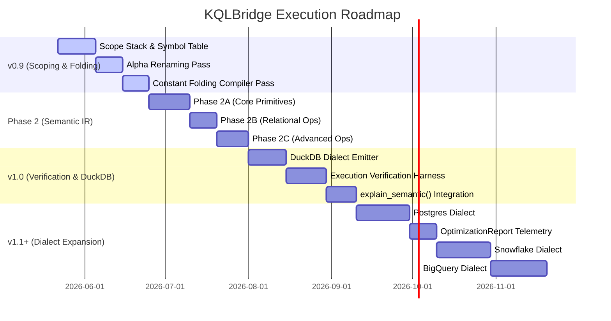

# KQLBridge Consolidated Architecture & Strategic Roadmap

This document serves as the authoritative blueprint for KQLBridge's evolution from a query transpiler into a thread-safe, compiler-grade query interoperability, validation, optimization, and portability platform.

---

## ➔ Phase 1 Retrospective (Complete)

Phase 1 successfully established the core compiler-grade foundations without breaking backward compatibility:

*   **Thread-Safe Translation Memory:** Synchronized cache lookups and rules mapping inside `memory.py` using `threading.Lock`.
*   **Four-Tier Capability Registry:** Declarative operator mappings across dialects (`NATIVE`, `EMULATED`, `PARTIAL`, `UNSUPPORTED`) via the `CapabilityLevel` Enum.
*   **Plugin Framework:** Extensible visitor overrides using the `@register_renderer(node_type, dialect)` and `@register_optimizer` decorators.
*   **Non-Mutating AST Optimizer:** Deep-copy isolated optimizer pipeline (`ASTOptimizer`) applying rule-based optimization passes.
*   **Lineage-Aware Predicate Safety:** Validated column lineage blocks across `extend`, `project aliases`, `summarize aliases`, and `join-generated columns` to prevent unsafe predicate pushdowns.
*   **Verification:** Complete suite of 343 tests passing with a 100% success rate under parallel thread stress contention.

---

## ➔ Strategic Direction: Front-End Architecture Pipeline

The platform is transitioning to a multi-stage semantic compilation pipeline:

```text
KQL Query Input
       ↓
  Lark Parser
       ↓
   Typed AST
       ↓
Scope Resolution   <-- Spawns Lexical Scope Stack
       ↓
Alpha Renaming     <-- Rewrites variables to compiler-safe names (__kqlbridge_sym_N)
       ↓
Constant Folding   <-- Resolves static expressions (e.g., let threshold = 10)
       ↓
  Semantic IR      <-- Core semantic intermediates (Phases 2A/2B/2C)
       ↓
  IR Optimizer     <-- Lineage-safe semantic optimization passes
       ↓
Target Generator   <-- Dialect code generation (DuckDB, Postgres, Snowflake, etc.)
       ↓
Dialect Target SQL
```

---

## ➔ Core Front-End Specifications

### 1. Scope Resolution
Resolves identifiers to their correct declaring scope and symbol classification.

#### Scope Types
```python
class ScopeType(Enum):
    GLOBAL = "GLOBAL"          # Outer let bindings
    PIPELINE = "PIPELINE"      # Sequential pipe operators (extend, project)
    SUBQUERY = "SUBQUERY"      # Relational subquery boundaries (joins, unions)
    AGGREGATE = "AGGREGATE"    # Aggregation boundary scopes
```

#### Symbol Kinds
```python
class SymbolKind(Enum):
    LET = "LET"                # Explicit scalar/tabular let declarations
    COLUMN = "COLUMN"          # Transient physical or generated columns
    AGGREGATE = "AGGREGATE"    # Aggregate metrics (e.g., count(), sum())
    PARAMETER = "PARAMETER"    # Query/engine parameters
    FUNCTION = "FUNCTION"      # Native or user-defined function mappings
```

#### Symbol Metadata tracking
```python
class SymbolInfo:
    def __init__(self):
        self.name: str = ""              # Original identifier
        self.unique_name: str = ""       # Compiler-generated non-colliding name
        self.symbol_kind: SymbolKind = SymbolKind.COLUMN
        self.scope_depth: int = 0
        self.origin_scope: SymbolTable = None
        self.origin_node: ASTNode = None # AST node where the symbol was defined
        self.derived_from: list[str] = []# Ancestor column lineage tracking
```
*Tracking origin metadata enables execution validation, lineage audits, and diagnostics logging via `explain_semantic()`.*

---

### 2. Lexical Scope Rules

*   **Rule 1: Let Inheritance:** Nested subqueries may resolve and inherit read-only `LET` bindings declared in parent scopes.
*   **Rule 2: Column Isolation:** Nested subqueries are strictly isolated from the parent pipeline's active `COLUMN` scope to prevent leaking outer query column names into the subquery context.
*   **Rule 3: Aggregate Boundaries:** Operators like `summarize` discard the active column namespace, creating an `AGGREGATE` scope boundary. Aggregation-generated columns behave differently from normal columns under pushdown rules.
*   **Rule 4: Correlated Subqueries:** Defer implementation during Phase 2. All correlated subquery patterns are marked and rejected as `CapabilityLevel.UNSUPPORTED`.

---

### 3. Alpha Renaming (Symbol Uniqueness)
To guarantee that compiler-inlined or translated variables never collide with user column names, shadowed identifiers are renamed to compiler-safe unique keys:
```text
__kqlbridge_sym_1
__kqlbridge_sym_2
```

---

### 4. Constant Folding
Static and scalar variables (e.g., `let threshold = 10; ... where Count > threshold`) are folded and substituted early. This ensures:
*   Simpler Semantic IR structures.
*   More efficient optimization passes.
*   Faster target-dialect execution times.

---

## ➔ Upcoming Milestone Roadmap



---

### 🛠 Milestone v0.9.0 — Let Chaining, Scoping, and Folding
*   **Lexical Scoping:** Implement `ScopeManager` and `SymbolTable` to resolve scopes stack-wise.
*   **Alpha Renaming:** Add compiler-safe variable generation (`__kqlbridge_sym_N`) for all shadowed identifiers.
*   **Constant Folding:** Evaluate and substitute static bindings sequentially before AST emission.

### 🛠 Phase 2 — Semantic IR Rollout
To prevent architectural bloat, the Semantic IR is introduced in three decoupled phases:
*   **Phase 2A:** Core query primitives: `SemanticQuery`, `SemanticFilter`, `SemanticProjection`, `SemanticAggregate`.
*   **Phase 2B:** Relational operations: `SemanticJoin`, `SemanticUnion`.
*   **Phase 2C:** Advanced database abstractions: `SemanticWindow`, `SemanticTimeSeries`, `SemanticJson`.

### 🛠 Milestone v1.0.0 — DuckDB & Execution Verification
*   **DuckDB Dialect:** Lightweight, fast in-memory execution target.
*   **Execution Verification Harness:** `verify(kql, generated_sql)` pipeline evaluating outputs between a reference KQL system and a local DuckDB target.
*   **`explain_semantic()`:** Diagnostics pass tracing the full AST-to-IR-to-SQL transformation.

### 🛠 Milestone v1.1+ — Dialect Expansion & Optimization Reports
*   **PostgreSQL, Snowflake, and BigQuery Support:** Production-grade dialect generation.
*   **`OptimizationReport` Telemetry:** Collect and expose filters-merged, predicates-pushed, and joins-rewritten counters.

---

## ❌ Deferred Work (Non-Priority)
To protect compiler-grade stability and correctness, the following abstractions are explicitly out-of-scope for the near-term roadmap:
*   AI query translation / Agentic rewriting pipelines.
*   LLM-based query generation.
*   Vector search abstractions.
