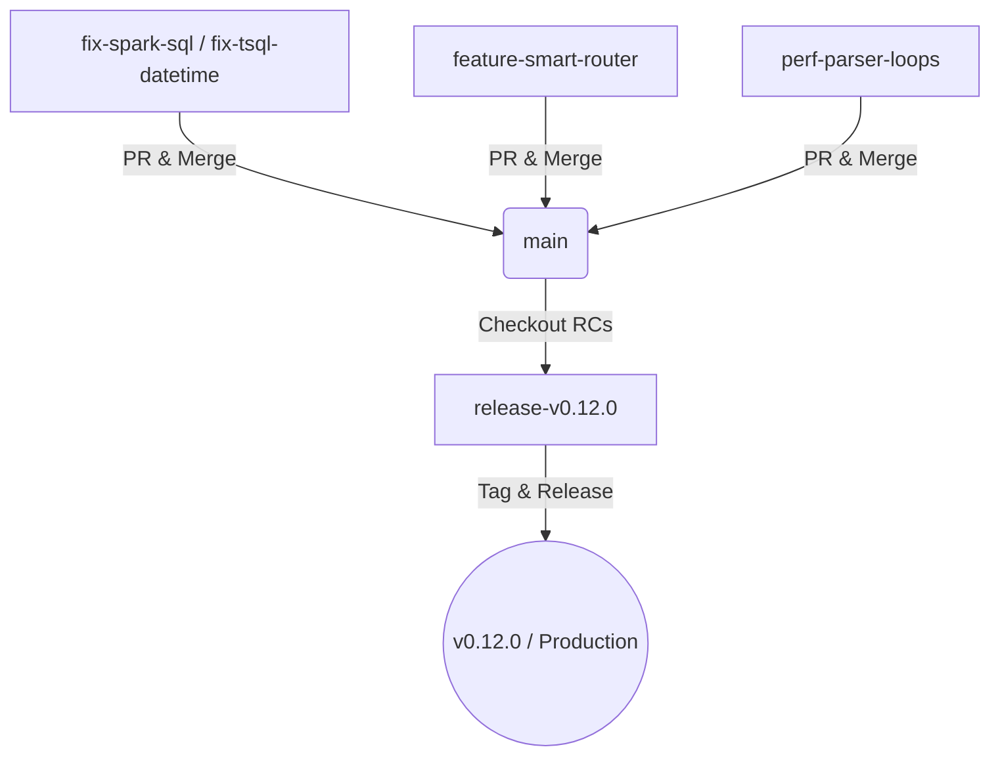

# Git Worktree and Branch Governance Strategy

This document establishes the architecture, usage boundaries, and workflow integration for the multi-branch Git Worktree setup in the `kqlbridge` translation engine. 

---

## 1. Directory Layout

The workspace partitions parallel streams of engineering into dedicated directories on your local drive to eliminate branch-switching and environment rebuild costs:

```text
c:/Users/navka/navakanth001/
├── kqlbridge/                            # [Primary Base] Main tracking baseline
└── kqlbridge-worktrees/
    ├── release-v0.12.0/                  # [Release Branch] RCs, Hotfixes, Tags
    ├── feature-smart-router/             # [Feature Branch] Routing & compilation paths
    ├── perf-parser-loops/                # [Performance Experimentation] Regex optimizations
    ├── verification-lab/                 # [Verification & Diagnostics] Sandbox
    ├── fix-spark-sql/                    # [Active Fix] Union/Extend resolution
    └── fix-tsql-datetime/                # [Active Fix] Datetime/Bool logic
```

---

## 2. Worktree Catalog & Guardrails

### 🔬 `verification-lab/` (The Scientist Lab)
* **Active Branch:** `verification-lab` (Branched from `main`)
* **Role:** Sandboxed execution, benchmarking, convergence analysis, and Oracle investigations.
* **Guardrails:** **NO production code modifications.** All scripts, DuckDB configurations, and trial queries must remain inside sandboxed paths or the `scratch/` directory.

### 🚀 `release-v0.12.0/` (Release Candidate Branch)
* **Active Branch:** `release/v0.12.0`
* **Role:** Finalizing QA clearances, compiling release candidate builds, resolving late-breaking regressions, and creating release tags.
* **Guardrails:** Only strict bugfixes and metadata bumps. Zero new feature merges.

### 🗺️ `feature-smart-router/` (Feature Isolation)
* **Active Branch:** `feature/smart-router`
* **Role:** Implementing multi-dialect routing logic, cost-based planning, and AST diagnostic reporting.
* **Guardrails:** Kept clean and current by rebase merges from `main` to prevent drift.

### ⚡ `perf-parser-loops/` (Performance Validation)
* **Active Branch:** `perf-parser-loops` (Tracking remote `origin/perf/optimize-parser-loops-11542030718474663810`)
* **Role:** Validating compiled regex performance optimizations, running microbenchmarks, and preventing parser regressions.
* **Guardrails:** Subject to exhaustive convergence sweeps against the baseline to guarantee 100% equivalence before main integration.

### 🛠️ `fix-spark-sql/` & `fix-tsql-datetime/` (Active Fixes)
* **Active Branches:** `fix-spark-sql-extend-union-...` and `fix-tsql-datetime-and-bool-...`
* **Role:** Localizing code updates for specific edge-case bugs identified in functional checks.

---

## 3. Merge Flow and Integration Policy



1. **Commit Hygiene:** Follow conventional commit guidelines (`fix(tsql):`, `feat(router):`, `chore(docs):`).
2. **Rebasing:** Keep feature branches clean. Rebase onto `main` regularly.
3. **Bisectability:** Avoid monolithic commits. Segment work into atomic, self-contained units (e.g., parsing, transformation, emission, and verification suites).
4. **Integration Gate:** Zero direct pushes to `main`. Every branch must pass linting, Functional Probes, and Concurrency stress suites before pull request approvals.
